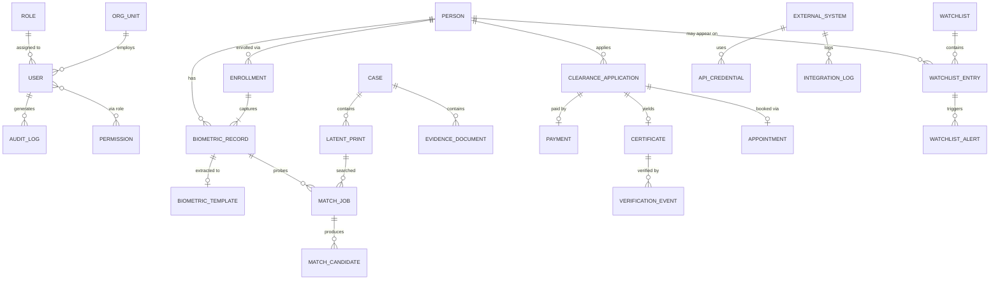

# DATABASE_DESIGN.md — ABIS Data Model

**Technology:** PostgreSQL 16. All models use UUID primary keys, `created_at` /
`updated_at`, and soft-delete (`is_deleted`) where evidentiary retention applies.
Biometric template bytes are encrypted at rest (Fernet via `cryptography`,
key from env `ABIS_FIELD_KEY`). Images/files live on media storage; DB stores
paths + SHA-256 hashes for chain of custody.

## Core Entities

## Key models by app

### accounts
- **User** (AbstractUser + `role FK`, `org_unit FK`, `badge_number`, `phone`, `must_change_password`, `password_changed_at`)
- **Role** (`name` in {admin, operator, investigator, supervisor, auditor}, `permissions M2M`)
- **UserActivityLog** (login/logout/failed attempts; distinct from AuditLog)

### basedata
- **OrgUnit** (self-FK `parent`, hierarchy) · **PersonCard/Person**
  (`person_no` unique, names, `date_of_birth`, `gender`, `nationality`,
  addresses JSONB, `national_id_no` nullable, photo path) ·
  **InvestigationCategory**, **LookupValue** (validation/standardization rules)

### registration / clearance / appointments / payments
- **ClearanceApplication** (`tracking_no` unique e.g. `PCC-2026-000001`, `person FK`,
  `purpose`, `contact_phone` (SMS notifications — ADR-024), `status` in {draft,
  submitted, paid, biometrics_captured, in_review, approved, rejected,
  certificate_issued}, scanned ID document path)
- **Certificate** (`certificate_no`, `verification_no` unique, `qr_payload`,
  signed PDF path, `issued_by FK`, `expires_at`, `status`)
- **Appointment** (`location FK Station`, `date`, `slot`, `status`) · **Station** + **TimeSlot**
- **Payment** (`amount`, `currency=ETB`, `method` in {telebirr, cbe_birr, chapa, cash},
  `gateway_ref`, `status`, `receipt_no`), **Reconciliation** batch

### enrollment / preprocessing
- **Enrollment** (`person FK`, `operator FK`, `station FK`, `status`, quality summary)
- **BiometricRecord** (`person FK`, `modality` in {finger, palm, face},
  `position` — NIST finger positions 1–10, palm L/R, face frontal/left/right —
  image path, `sha256`, `quality_score` (NFIQ-like 1–5), `nist_ref`)
- **BiometricTemplate** (`record FK`, `engine`, encrypted `template_bytes`, `version`)

### matching / pis / investigation
- **MatchJob** (`job_type` in {TP-TP, TP-LT, LT-TP, LT-LT, FACE-1N, VERIFY-1_1, DEDUP},
  probe: `probe_record FK` (TP-*/FACE) or `probe_latent FK` (LT-*, T-009) or
  `probe_enrollment FK` (DEDUP multi-record probe — ADR-017) or
  `probe_photo FK` (pis PhotoProbe upload — ADR-019), `status` in
  {queued, running, done, failed}, `threshold`, `requested_by FK`, timings)
- **PhotoProbe** (pis; uploaded face image path, `sha256`, `uploaded_by FK` —
  probe of photo-initiated FACE-1N searches, ADR-019)
- **MatchCandidate** (`job FK`, `person FK` nullable, `record FK` nullable,
  `latent FK` nullable — person-DB hits carry person+record, latent-file hits
  carry latent (identity unknown); DB check: record OR latent set (ADR-018) —
  `score`, `rank`, `decision` in {undecided, hit, no_hit}, `verified_by FK`)
- **Case** (`case_no`, `category FK`, `status`, `lead_investigator FK`)
- **LatentPrint** (`case FK`, image path, enhanced image path, minutiae JSONB,
  `modality` finger|palm, editor history JSONB)
- **EvidenceDocument** (chain-of-custody fields: `collected_by`, `collected_at`, `sha256`)

### watchlist / verification / audit / apimgmt / notifications / devices / documents / reports
- **Watchlist** (`list_type` in {criminal, terrorist, immigration_blacklist, fraud})
  · **WatchlistEntry** (`person FK`, `reason`, `severity`, `active`) ·
  **WatchlistAlert** (`entry FK`, `trigger_job FK`, `acknowledged_by`)
- **VerificationEvent** (`certificate FK`, `channel` in {portal, qr, api}, `verifier_ip`, `result`)
- **AuditLog** (`actor FK nullable`, `action`, `entity`, `entity_id`, `changes JSONB`,
  `ip`, `user_agent`, `at`) — INSERT-ONLY; no updates or deletes permitted
- **ExternalSystem** (fayda, immigration, courts, crims, efp_app, sps, resident_id),
  **ApiCredential** (hashed key, scopes), **IntegrationLog**
- **SmsMessage** outbox (`to`, `template`, `body`, `status`, `provider_ref`)
- **Device** (`type` in {finger_scanner, palm_scanner, flatbed, signature_pad,
  camera, webcam, printer, mobile_handheld}, `station FK`, `serial`, `status`, `simulated bool`)
- **StoredDocument** (generic files, NIST exports, migration batches)
- **ReportDefinition**, **ReportRun** (`format` pdf|xlsx|csv, file path, `scheduled` cron)

## Migrations & conventions

- One initial migration per app in dependency order: accounts → basedata →
  enrollment → matching → the rest.
- Seed command `python manage.py seed_demo` creates roles, an admin user,
  stations, lookups, 50 demo persons with mock biometrics, and sample watchlists.
- Important indexes: `Person.person_no`, `ClearanceApplication.tracking_no`,
  `Certificate.verification_no`, `MatchJob(status, created_at)`,
  `AuditLog(entity, entity_id)`, GIN on `Person.addresses`.
